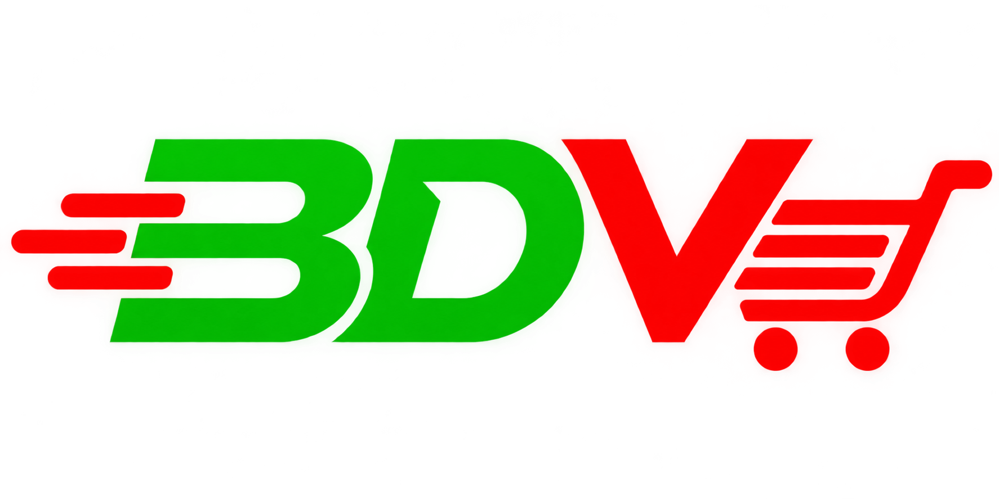

<div align="center">



# ▞▚ BD VAULT ▞▚

### Gear up. Lock in. Game on.

**A zero-dependency gaming-gear storefront for Bangladesh — complete with cart, checkout, accounts and a full admin console. No server. No build step. Just open it.**

<br/>


[**Features**](#-features) · [**Quick start**](#-quick-start) · [**Admin console**](#-admin-console) · [**Architecture**](#-architecture) · [**Roadmap**](#-roadmap)

</div>

---

## ⚡ What is this?

**BD VAULT** is a front-end e-commerce project for PC & console gaming peripherals — keyboards, mice, headsets, controllers, monitors and accessories — priced in **Bangladeshi Taka (৳)**.

It is built entirely with **HTML, CSS and vanilla JavaScript**. All data (products, users, orders, offers, cart) lives in the browser's `localStorage` behind one small data layer (`store.js`), so the whole shop runs from a folder on your disk and can later be pointed at a real backend by swapping a single file.

```
 ┌─────────────┐     ┌──────────────────┐     ┌─────────────────────┐
 │  Storefront │ ◄─► │  store.js (BDV)  │ ◄─► │  localStorage       │
 │  17 pages   │     │  data-layer API  │     │  (swap for backend) │
 └─────────────┘     └──────────────────┘     └─────────────────────┘
        ▲                      ▲
        │                      │
 ┌─────────────┐        ┌─────────────┐
 │  script.js  │        │  admin.js   │
 │  UI + cart  │        │  console    │
 └─────────────┘        └─────────────┘
```

---

## ✨ Features

<table>
<tr>
<td width="50%" valign="top">

### 🛒 Storefront
- **6 categories** — Keyboards, Mouse, Headsets, Controllers, Monitors, Accessories
- **Price sorting** (low → high / high → low) on every listing
- **Persistent cart** with quantity controls and live header badge
- **Cross-tab sync** — cart updates instantly across open tabs
- **Checkout** with Dhaka-aware delivery pricing (৳60 inside / ৳120 outside)
- **Limited-time offer banner** with an end date that auto-expires
- Sale pricing that switches on/off with the active offer

</td>
<td width="50%" valign="top">

### 🎨 Experience
- **Dark / light theme** toggle, remembered between visits
- **Interactive hero** — a cursor-reactive light grid that follows your mouse
- **Responsive** layout with an animated mobile navigation menu
- Keyboard accessible (`Esc` closes nav, focus-visible states, ARIA labels)
- Dedicated **Help/FAQ, Shipping, Returns, Privacy and About** pages

</td>
</tr>
<tr>
<td width="50%" valign="top">

### 👤 Accounts
- Register / login with **"remember me"**
- Passwords are **SHA-256 hashed** via the Web Crypto API — never stored in plain text
- Session handling built into the data layer

</td>
<td width="50%" valign="top">

### 🛠️ Admin console
- Password-gated panel with **first-run setup**
- Full **product CRUD** with image upload
- **Offer manager**, **order viewer**, **stats** overview
- **Export / import** backups and a one-click reset

</td>
</tr>
</table>

---

## 🚀 Quick start

No installs. No bundlers. No `npm`.

```bash
# 1. Clone or unzip the project
cd bdvault

# 2. Open it — either double-click index.html, or serve it locally:
python3 -m http.server 8080
#   → http://localhost:8080
```

> **💡 First-time tip:** the shop starts empty. Open `admin.html`, create your admin password, then go to **Data & Security → Import** and load [`demo-products.json`](demo-products.json) to fill the store with **31 sample products** instantly.

---

## 🧭 Admin console

Open **`/admin.html`** — on first visit you'll be asked to create a password (min. 8 characters). After that it's a standard login.

| Tab | What you can do |
|---|---|
| **Products** | Add, edit, delete products · upload images · set price, sale price, brand, specs, featured flag |
| **Offer** | Configure the home-page limited-time banner — headline, end date, on/off toggle |
| **Orders** | Browse every order placed at checkout, with items, totals and customer details |
| **Data & Security** | Export/import products as JSON · change admin password · wipe all products |

### Product schema

```jsonc
{
  "id": "demo-keyboard-1",
  "category": "keyboard",        // keyboard | mouse | headsets | controller | monitor | accessories
  "name": "Redragon K552 Kumara",
  "brand": "Redragon",
  "price": 3850,                 // ৳
  "salePrice": 3500,             // optional — applied only while an offer is active
  "image": "Image/k1.jpg",
  "specs": ["Mechanical", "TKL", "RGB"],
  "featured": true
}
```

---

## 🧱 Architecture

```
bdvault/
├── index.html            Home — hero, offer banner, featured gear
├── categories.html       Category hub
├── keyboard.html  mouse.html  headsets.html
├── controller.html  monitor.html  accessories.html     Product listings
├── cart.html             Cart + checkout
├── login.html  register.html                           Accounts
├── admin.html            Admin console
├── about / help / shipping / returns / privacy .html   Info pages
│
├── store.js              ★ BDV data layer — products, offers, orders, users, auth
├── script.js             Storefront UI — theme, cart, sorting, nav, hero, auth forms
├── admin.js              Admin console logic
├── style.css             Storefront styles (dark + light themes)
├── admin.css             Admin styles
├── demo-products.json    31 importable sample products
└── Image/                Logo, hero background, category art
```

### The `BDV` data layer

Everything the UI needs flows through one global object, so the persistence strategy is replaceable in one place:

| Namespace | Responsibility |
|---|---|
| `BDV.products` | `all()` · `save()` · `byCategory(id)` |
| `BDV.offer` | `get()` · `save()` · `active()` (honours expiry date) |
| `BDV.price(p)` | Resolves the live price — sale price only while an offer is active |
| `BDV.orders` | `all()` · `add()` · `save()` |
| `BDV.auth` | `register()` · `login()` with hashed passwords |
| `BDV.hash(s)` | SHA-256 via Web Crypto (with a fallback) |

**Storage keys:** `bdvault-products-v1` · `bdvault-orders-v1` · `bdvault-users-v1` · `bdvault-offer-v1` · `bdvault-session`

---

## 🔐 Security note

BD VAULT is a **front-end demo**. Hashing keeps passwords out of plain text, but because everything runs in the browser, the admin gate and user accounts are **not real security** — anyone with dev-tools access can read or edit `localStorage`. Do not use it to handle real customers or payments until a backend is added.

---

## 🗺️ Roadmap

- [ ] Replace `localStorage` with a REST / Firebase / Supabase backend (only `store.js` needs to change)
- [ ] Real payment gateway — bKash, Nagad, SSLCommerz
- [ ] Server-side auth with sessions / JWT
- [ ] Product search, filters and reviews
- [ ] Order status tracking and email notifications
- [ ] Bangla language toggle (বাংলা)

---

## 🤝 Contributing

Ideas and pull requests are welcome.

1. Fork the repo
2. Create a branch — `git checkout -b feature/my-idea`
3. Commit and push
4. Open a pull request

---

<div align="center">

**Built with ❤️ in Bangladesh 🇧🇩**

*BD VAULT — your next setup starts here.*

</div>